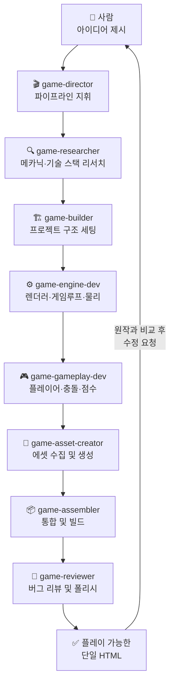
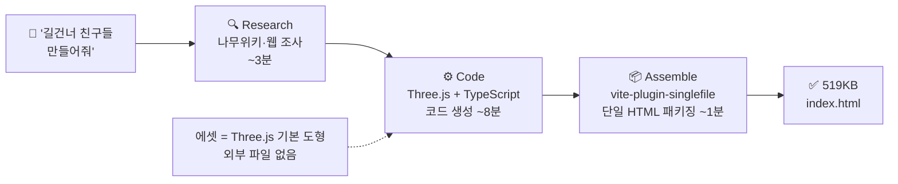
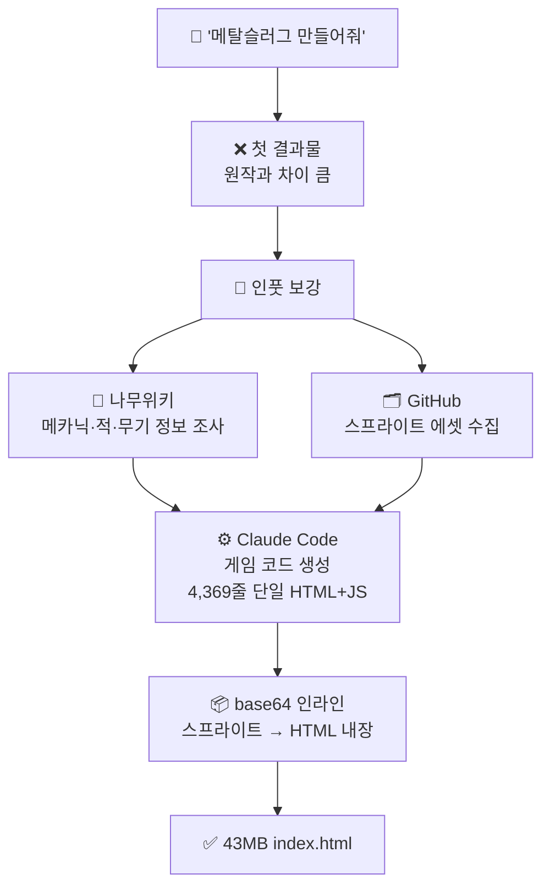

# AI 게임 개발 실험 — 종합 리포트

> 기간: 2026-05-05 ~ 2026-05-09  
> 목표: Claude Code를 활용해 게임 아이디어를 플레이 가능한 브라우저 게임으로 만들기

---

## 1. 프로젝트 개요

Claude Code의 멀티 에이전트 파이프라인을 활용해 두 가지 게임을 제작했다.

| 게임 | 장르 | 소요 시간 | 결과물 크기 |
|------|------|-----------|------------|
| 길건너 친구들 (Crossy Road Clone) | 3D 아케이드 | ~15분 | 519KB 단일 HTML |
| Metal Slug Tribute | 2D 사이드스크롤 액션 | ~수 시간 | 43MB 단일 HTML |

두 게임 모두 `index.html` 하나를 브라우저에서 열면 바로 플레이 가능한 형태로 완성됐다.

---

## 2. AI 활용 방식

### 2.1 에이전트 파이프라인

`game-director` 에이전트가 전체 파이프라인을 지휘하고, 각 단계를 전담 에이전트가 처리했다.

### 2.2 인풋이 결과물 품질을 결정한다

두 게임 모두 **인풋의 품질이 결과물의 품질을 직접 결정**했다.

**길건너 친구들**
- 리서치 에이전트가 나무위키·웹에서 원작 메카닉을 사전에 조사
- 조사 결과를 인풋으로 제공해 코드 생성 에이전트가 정확한 게임 규칙을 구현

**Metal Slug Tribute**
- 처음엔 "메탈슬러그 만들어줘" 한 줄만 제공 → 결과 불만족
- 나무위키 게임 정보 + GitHub 스프라이트 에셋을 함께 제공 → 원작에 가까운 결과
- **구체적인 레퍼런스를 많이 줄수록 원본과 유사해짐**

### 2.3 사람이 개입하는 구간

AI가 모든 것을 한 번에 완성하지는 않았다. 사람이 직접 개입한 구간이 명확히 존재했다.

| 구간 | 사람의 역할 |
|------|------------|
| 리서치 방향 설정 | 어떤 정보를 조사할지 기준 제시 |
| 원작 레퍼런스 제공 | 스크린샷·영상·위키 자료를 직접 수집해서 인풋으로 제공 |
| 결과물 검토 | 플레이해보며 원작과 비교 |
| 수정 요청 | 구체적으로 "카메라가 너무 멀다", "화면비가 다르다" 식으로 피드백 |

---

## 3. 게임별 작업 과정

### 3.1 길건너 친구들

**파이프라인**

**총 소요: 약 15분**

**반복 수정 루프**

첫 빌드에서 바로 완성되지 않았다. 원작 레퍼런스와 비교하며 6회 수정했다.

| 문제 | 수정 전 | 수정 후 |
|------|--------|--------|
| 카메라 거리 | 너무 멀어서 캐릭터가 작음 | 원작 수준으로 가까이 |
| 화면비 | 16:9 가로 | 9:16 세로 (모바일 원작과 동일) |
| 밝기 | 어두운 톤 | 밝고 선명한 색감 |
| 바닥 크기 | 맵 밖이 보임 | 화면을 꽉 채움 |
| 캐릭터 방향 | 이동 반대 방향을 바라봄 | 이동 방향으로 수정 |
| 나무 충돌 | 나무를 통과함 | 나무가 장애물로 작동 |

**수치 요약**

| 항목 | 값 |
|------|-----|
| 코드 줄 수 | ~1,900줄 |
| 소스 파일 수 | 13개 |
| 빌드 크기 | 519KB (단일 HTML) |
| 에셋 방식 | Three.js 기본 도형 조합 (외부 파일 없음) |
| 수정 횟수 | 6회 |
| 아이디어 → 플레이 | ~15분 |

---

### 3.2 Metal Slug Tribute

**파이프라인**

**구현된 기능**

- 플레이어: 이동, 점프, 웅크리기, 사격, 수류탄
- 무기 시스템: 피스톨, HMG, 로켓, 샷건
- 플레이어 애니메이션: idle, walk, shoot, jump, grenade, crouch, look up 7종
- 적: 보병, 바주카병, 낙하병 등 다수
- 사이드스크롤 8000px 레벨
- 이펙트: 스크린셰이크, 히트스톱, 파티클, 폭발

**수치 요약**

| 항목 | 값 |
|------|-----|
| 코드 줄 수 | 4,369줄 (단일 파일) |
| 빌드 크기 | 43MB (스프라이트 base64 인라인) |
| 플레이어 애니메이션 | 13종 |
| 적 종류 | 7종 |
| 사운드 | 24개 |

---

## 4. AI 활용의 효과와 한계

### 잘 된 것

**빠른 프로토타이핑**  
아이디어에서 플레이 가능한 게임까지 15분. 기획·설계·구현·빌드를 AI가 전담하고 사람은 방향만 잡았다.

**게임 로직 구현 완성도**  
충돌 판정, 물리, 카메라 추적, 상태 머신, 파티클 등 복잡한 게임 로직을 AI가 대부분 올바르게 구현했다.

**단일 파일 배포**  
vite-plugin-singlefile(길건너), base64 인라인(메탈슬러그)으로 서버나 설치 없이 HTML 하나로 배포 가능한 형태로 완성됐다.

**도형 기반 에셋 생성**  
길건너의 경우 Three.js BoxGeometry 조합만으로 닭, 차, 트럭, 나무 등을 코드 안에서 직접 생성했다. 외부 에셋 없이도 원작 느낌을 재현하는 것이 가능했다.

### 한계

**레퍼런스 없이는 품질이 낮다**  
"메탈슬러그 만들어줘" 한 줄로는 불만족스러운 결과가 나왔다. 원작 정보와 에셋을 직접 제공해야 품질이 올라갔다.

**스프라이트 애니메이션 전환 문제**  
AI가 각 스프라이트를 독립적으로 생성하면 pivot, 크기, 프레임 수가 에셋마다 달라져 전환 시 캐릭터가 튀는 현상이 발생했다. 에셋을 세트로 묶어 일관성을 명시해줘야 해결 가능하다.

**게임 필 튜닝은 사람이 직접**  
홉 애니메이션 높이, 카메라 부드러움, 차량 간격과 속도 같은 미세한 수치는 직접 플레이해보며 조정해야 했다. AI가 합리적인 초기값을 제시하지만 '좋은 느낌'을 만드는 마지막 단계는 사람의 감각이 필요했다.

**43MB는 비현실적**  
모든 스프라이트를 base64로 인라인하면 단일 파일이 되지만 용량이 너무 크다. 실용적인 배포를 위해서는 에셋 서빙 방식을 따로 설계해야 한다.

---

## 5. 핵심 인사이트

1. **인풋 품질 = 결과물 품질**  
   AI에게 "만들어줘" 한 마디보다 구체적인 레퍼런스·자료·에셋을 함께 줄수록 원하는 결과에 가까워진다.

2. **AI는 로직을 잘 만든다, 느낌은 사람이 잡는다**  
   게임 시스템·충돌·상태 머신 같은 논리적인 구조는 AI가 잘 처리한다. 반면 게임 필, 밸런스, 원작과의 시각적 차이는 사람이 직접 플레이해보며 잡아야 한다.

3. **반복이 필수**  
   한 번에 완성되는 게 아니라 빌드 → 확인 → 수정 루프를 반복하는 과정 자체가 AI와 협업하는 방식이다.

4. **에셋은 세트로**  
   스프라이트처럼 서로 연관된 에셋은 일관성(크기·pivot·프레임 수)을 명시한 상태로 세트 단위로 생성해야 한다. 독립 생성하면 전환 시 불일치가 발생한다.
